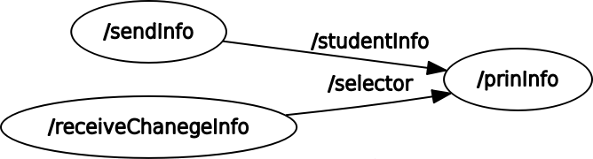
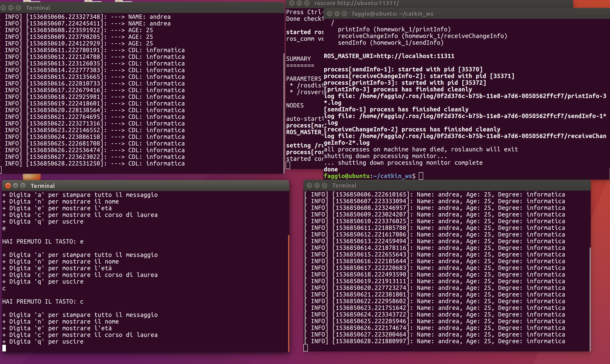

# ros_homework_1 #
##### Homework 1 [Laboratorio Ciberfisico] - University of Verona #####

### Specifiche ###
Si realizzi un package ROS contenente degli opportuni nodi 
per poter svolgere i compiti seguenti

* Un nodo pubblica, 1 volta al secondo, un messaggio contenente un nome, una età, e un corso di laurea 
* Un nodo permette di selezionare da tastiera quale parte del messaggio verrà mostrata a video (si veda la pagina seguente per i dettagli) 
* Un nodo mostra a video la parte del messaggio selezionata 

Il nodo che permette di selezionare da tastiera quale parte del messaggio mostrare dovrà comportarsi nel modo seguente:

* Digitando ‘a’ verrà stampato tutto il messaggio
* 'n’ mostrerà solo il nome
* ‘e’ mostrerà solo l’età
* ‘c’ mostrerà solo il corso di laurea

### Starting nodes ###

Scaricare tramite gitclone il repository

Compilare il pacchetto scaricato tramite il comando:
```sh
$ catkin_make --pkg homework_1
```
Lanciare nodo radice:
```sh
$ roscore
```
Lanciare i nodi tramite comando shell:
```sh
$ roslaunch homework_1 info.launch
```

### Grafici di esecuzione ###


### screenshot ###


### Autore ###

* `Andrea Faggion`, Università di Verona [andrea.faggion@studenti.univr.it](mailto:andrea.faggion@studenti.univr.it)
